# BigQuery Release Pulse

An elegant, real-time release notes tracker and social sharing helper for Google Cloud BigQuery updates. Built with a Python Flask server backend and a sleek, modern, interactive vanilla HTML/JS/CSS frontend.


---

## 🚀 Key Features

* **Real-Time Data Ingestion**: Seamlessly requests and parses Google Cloud's BigQuery documentation Atom XML feed.
* **Offline Resilience**: Features an automatic fallback system that reads from a local copy (`cache_feed.xml`) in case of internet connection loss or `429 Too Many Requests` API limits.
* **Granular Feed Decomposition**: Automatically parses date blocks containing multiple releases into individual, category-coded cards (e.g. *Feature*, *Change*, *Announcement*, *Issue*).
* **Live Search & Pill Filters**: Instantly query entries by keyword or filter by type in real-time.
* **X/Twitter Publisher Helper**:
  * **Single-Card Sharing**: Compose a tweet draft for any specific update instantly with the click of a button.
  * **Batch Multi-Select Summarizer**: Check multiple updates to activate the floating selection drawer, generating a concise summary tweet under the 280-character limit.
* **Premium Dark Theme**: Built with CSS variables, featuring glowing borders, micro-animations, glassmorphic UI panels, and custom layouts.

---

## 📂 Project Structure

```text
bq-releases-notes/
├── app.py                  # Flask server logic & feed parser
├── cache_feed.xml          # High-fidelity backup feed data
├── requirements.txt        # Python package dependencies
├── .gitignore              # Ignores virtual env and system files
├── templates/
│   └── index.html          # Semantic HTML layout
└── static/
    ├── css/
    │   └── style.css       # Layout styles & responsive design
    └── js/
        └── app.js          # DOM manipulation, state, and search logic
```

---

## 🛠️ Setup & Installation

### Prerequisites
* Python 3.8 or higher installed on your system.

### 1. Set Up Virtual Environment
Initialize a local virtual environment to manage dependencies:
```bash
python -m venv .venv
```

Activate the environment:
* **Windows (PowerShell)**:
  ```powershell
  .venv\Scripts\Activate.ps1
  ```
* **Windows (Command Prompt - cmd)**:
  ```cmd
  .venv\Scripts\activate.bat
  ```
* **Linux / macOS**:
  ```bash
  source .venv/bin/activate
  ```

### 2. Install Dependencies
Install the required Flask and parsing packages:
```bash
.venv\Scripts\pip install -r requirements.txt
```

### 3. Run the Development Server
Launch the application locally:
```bash
.venv\Scripts\python app.py
```
Open **[http://127.0.0.1:5000/](http://127.0.0.1:5000/)** in your web browser.

---

## 🔄 Request-Response Lifecycle Flow

Below is the request-response sequence when a user clicks the **Refresh** button on the client side:

```mermaid
sequenceDiagram
    actor User
    participant Client as Client Browser (app.js)
    participant Server as Flask Server (app.py)
    participant Cache as cache_feed.xml
    participant Google as Google Cloud Feed (docs.cloud.google.com)

    User->>Client: Click "Refresh"
    Client->>Client: Rotate loader, display spinner, hide current feed
    Client->>Server: HTTP GET /api/releases
    
    rect rgb(30, 41, 59)
        note over Server: Attempting Live Ingestion
        Server->>Google: Fetch remote Atom feed (with User-Agent spoofing)
        alt Success (HTTP 200 OK)
            Google-->>Server: Return XML feed data
        else Rate Limited (HTTP 429) or Offline
            Server->>Cache: Read backup XML cache
            Cache-->>Server: Return backup XML data
        end
    end
    
    Server->>Server: Parse XML using feedparser
    Server-->>Client: Return JSON array (status, source, entries)
    
    Client->>Client: DOMParser parses HTML contents and splits into cards
    Client->>Client: Render type-coded cards, apply search filters, display connection status
    Client->>User: Display updated releases & stop spinner
```



---

## 📝 Usage Details

### Refreshing Data
Click the **Refresh** button in the header. The spinner will animate while fetching live documentation feeds. The connection status indicator displays:
* 🟢 **Live Feed Connected**: Successfully loaded updates from the live feed.
* 🟡 **Cached Data (Offline)**: Encountered network issues or automated request caps and loaded backup data instead.

### Composing Tweets
1. **Individual Update**: Click the X/Twitter icon on the top right of any card. A customization window pops up with a pre-configured post including hashtags and links, keeping track of your character limit.
2. **Multiple Updates**: Check the boxes on multiple cards. The bottom selection tray will emerge. Click **Tweet Selected Summary** to generate a formatted list of all chosen items, optimized to fit within the 280-character limit.
